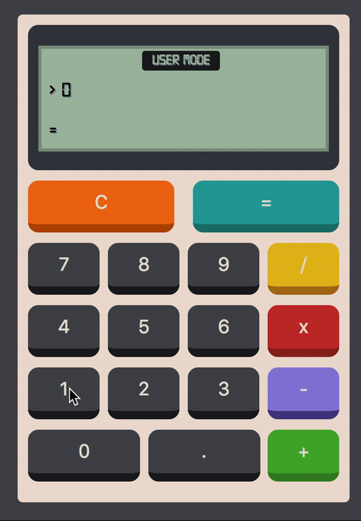

# Calculator

## Synopsis

A simple calculator. You can try it at https://atoulmet.github.io/calculator/

## How to

To start the app, first run `npm install` then `npm start`. A new window will open on http://localhost:3000/.

## Technologies

ReactJS / Redux.
The project was created through <a href='https://github.com/facebook/create-react-app'> Create-React-App</a>.

## Design

I was inspired by the design of the video game Calculator The Game to create this retro design.
